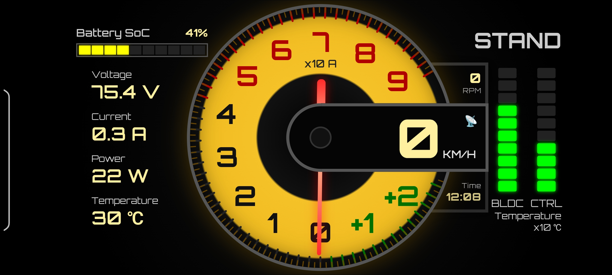

# FOX-R Custom Dashboard

Modern real-time dashboard untuk sepeda motor listrik berbasis **Votol Controller**, **ESP32 CAN Gateway**, dan **Android Runtime**.

Dashboard dirancang agar mudah dikustomisasi, mendukung telemetry melalui **BLE** maupun **WiFi**, serta memungkinkan pengembang membuat tema dan tampilan dashboard sendiri hanya dengan memodifikasi `dashboard.html`.

---

## Dashboard Preview



Tampilan dashboard utama FOX-R dengan speedometer, RPM, temperatur, dan informasi baterai secara real-time.

---

## Fitur Utama

- Real-time Speedometer
- RPM Monitoring
- Battery Voltage Monitoring
- Battery Current Monitoring
- Power Monitoring
- State of Charge (SOC)
- Motor Temperature
- Controller Temperature
- Battery Temperature
- Cell Voltage Monitoring
- Cell Voltage Statistics
- Battery Health Monitoring
- Charger Monitoring
- BLE Telemetry
- WiFi Telemetry
- GPS Speed Support
- Clock / Real Time Display
- Internal WebSocket Bridge
- Dashboard Theme Customization
- ESP32 OTA Compatible

---

# Arsitektur Sistem

```text
┌─────────────────┐
│ Votol Controller│
└────────┬────────┘
         │ CAN Bus
         ▼
┌─────────────────┐
│ ESP32 Gateway   │
└───────┬─────────┘
        │
 ┌──────┴──────┐
 │             │
 ▼             ▼
BLE           WiFi
 │             │
 └──────┬──────┘
        ▼
┌─────────────────┐
│ Android Runtime │
└────────┬────────┘
         │
         │ Internal WebSocket
         ▼
┌─────────────────┐
│ dashboard.html  │
└─────────────────┘
```

---

# Firmware ESP32

Project ini menggunakan firmware:

urlvotol-esp32-can-bushttps://github.com/zexry619/votol-esp32-can-bus/tree/beta

ESP32 berfungsi sebagai gateway CAN Bus dan mengirimkan telemetry ke Android melalui BLE atau WiFi.

---

# Struktur Project

```text
app/
├── src/
│   ├── main/
│   │   ├── java/
│   │   │   └── com/votol/dashboard/
│   │   ├── assets/
│   │   │   └── dashboard.html
│   │   ├── res/
│   │   └── AndroidManifest.xml
│   └── ...
│
├── ble/
├── wifi/
├── websocket/
├── repository/
├── mapper/
├── debug/
└── ...
```

---

# Alur Data

1. Controller Votol mengirim data melalui CAN Bus.
2. ESP32 membaca CAN Bus.
3. ESP32 mengirim telemetry melalui BLE atau WiFi.
4. Android menerima data telemetry.
5. Data dinormalisasi.
6. Data diteruskan ke dashboard melalui WebSocket internal.
7. Dashboard memperbarui tampilan secara real-time.

---

# JSON Normalisasi

Contoh JSON yang diterima dashboard:

```json
{
  "speed": 45,
  "gpsSpeed": 44.8,
  "rpm": 1500,
  "volts": 72.5,
  "amps": 18.4,
  "power": 1334,
  "soc": 84,
  "mode": "DRIVE",
  "temps": {
    "ctrl": 42,
    "motor": 55,
    "batt": 31
  }
}
```

---

# GPS Speed

Field `gpsSpeed` berasal dari sensor GPS Android.

Jika tujuan utama adalah mendapatkan kecepatan kendaraan yang paling mendekati kondisi nyata di jalan, disarankan menggunakan `gpsSpeed` sebagai prioritas utama.

Keunggulan GPS Speed:

- Lebih akurat terhadap kecepatan aktual kendaraan.
- Tidak dipengaruhi ukuran ban.
- Tidak dipengaruhi rasio gear.
- Tidak dipengaruhi kesalahan kalibrasi controller.
- Cocok untuk verifikasi data speed CAN Bus.
- Cocok untuk integrasi navigasi.

Contoh:

```javascript
const speed = data.gpsSpeed ?? data.speed ?? 0;
```

---

# Menampilkan Waktu

```javascript
function updateDateTime() {
    const now = new Date();

    const hour = String(now.getHours()).padStart(2, "0");
    const minute = String(now.getMinutes()).padStart(2, "0");

    document.getElementById("hours-minutes").innerText =
        `${hour}:${minute}`;
}

updateDateTime();
setInterval(updateDateTime, 1000);
```

---

# Contoh Implementasi JSON

## Menampilkan JSON Mentah

```html
<pre id="json-debug"></pre>
```

```javascript
socket.onmessage = (event) => {
    document.getElementById("json-debug").textContent =
        event.data;
};
```

## Parsing JSON

```javascript
socket.onmessage = (event) => {
    const data = JSON.parse(event.data);
    console.log(data);
};
```

## Mengambil Nilai

```javascript
const speed = data.speed;
const gpsSpeed = data.gpsSpeed;
const rpm = data.rpm;
const volts = data.volts;
const amps = data.amps;
const soc = data.soc;
```

## Update Dashboard

```javascript
function updateDashboard(data) {

    document.getElementById("speed").innerText =
        Math.round(data.gpsSpeed ?? data.speed ?? 0);

    document.getElementById("rpm").innerText =
        data.rpm ?? 0;

    document.getElementById("battery").innerText =
        (data.soc ?? 0) + "%";
}
```

## Simulasi Tanpa ESP32

```javascript
updateDashboard({
    speed: 45,
    gpsSpeed: 44.8,
    rpm: 1500,
    volts: 72.5,
    amps: 18.4,
    soc: 84,
    mode: "DRIVE"
});
```

---

# Kustomisasi Dashboard

Semua tampilan berada pada:

```text
dashboard.html
```

Anda bebas mengubah:

- Layout
- Gauge
- Warna
- Font
- Animasi
- Widget
- Grafik
- GPS Indicator
- Clock Widget
- Tema Siang/Malam

Tanpa perlu mengubah firmware ESP32.

---

# BLE vs WiFi

| Fitur | BLE | WiFi |
|---------|---------|---------|
| Konsumsi Daya | Rendah | Lebih Tinggi |
| Latency | Baik | Sangat Baik |
| Bandwidth | Rendah | Tinggi |
| Setup | Mudah | Perlu WiFi |
| Cocok Untuk | Fast Packet | Full Packet |

---

# Roadmap

- [ ] Android Auto
- [ ] Trip Computer
- [ ] Ride Statistics
- [ ] CAN Logger
- [ ] Telemetry Recording
- [ ] Theme Manager
- [ ] Cloud Sync
- [ ] OTA Dashboard Update
- [ ] Navigation Mode
- [ ] Split Screen Dashboard

---

# Kontribusi

Pull Request, Issue, dan Feature Request sangat diterima.

Jika menemukan bug:

1. Buka Issue.
2. Sertakan screenshot.
3. Sertakan log.
4. Sertakan versi firmware dan aplikasi.

---

# Kredit

### ESP32 CAN Gateway

https://github.com/zexry619/votol-esp32-can-bus

### Dashboard Development

Chandra Cahyo

---

# Lisensi

Non-Commercial License.

Penggunaan pribadi, edukasi, penelitian, dan hobi diperbolehkan.

Penggunaan komersial, redistribusi komersial, atau integrasi ke produk berbayar memerlukan izin tertulis dari pembuat.
